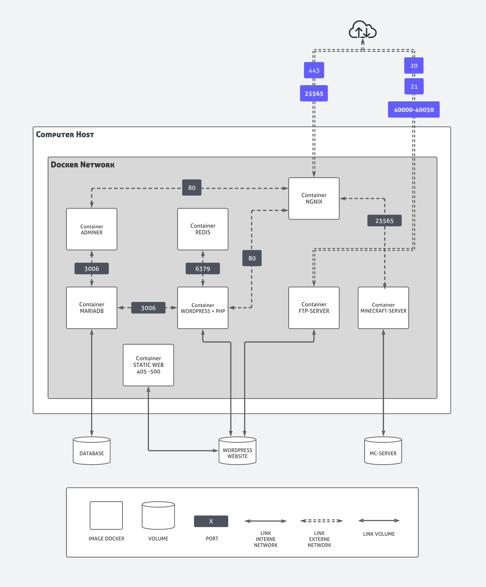

# Inception

This project aims to deepen the knowledge of system administration.

Use of dockerfile for the creation and management of custom images, micro services.

Use of docker-compose for the deployment of containers, the creation and management of the network, storage space, etc ...

## Structure of the project with the bonuses



# DOCKER

## BASIC DOCKER COMMANDS

* ```docker ps -a``` : List active containers (-a is for showing all containers, running and stopped)
* ```docker stop  <id>/<name>``` : Stop running containers
* ```docker start <id>/<name>``` : Start stopped containers
* ```docker rm -f <id>/<name>``` : Remove containers (-f is for force the removal of a running container)
* ```docker exec -it <name> bash``` : Execute a command in a running container


Tips to delete all containers, use: ```docker rm -f $(docker ps -qa)```

## DOCKER RUN

``` bash
$ docker run [OPTIONS] IMAGE[:TAG]
```

| Parameters | Description                       |
| :-------- | :-------------------------------- |
| `-d`      | Run container in background (daemon mode) |
| `-it`      | creating an interactive container |
| `-p`      | Publish a container port(s) to the host |
| `--rm`      | Automatically remove the container when it exits |
| `--hostname`      | Container host name |
| `--name`      |  Assign a name to the container |

#### Exemple 
```
$ docker run -d -ti -p 80:80 --rm --name web-ngnix --hostname nginx-container nginx:latest
```
use ```docker ps``` to list running containers
``` bash
CONTAINER ID   IMAGE          COMMAND                  CREATED         STATUS         PORTS                               NAMES
86335dfeaa0b   nginx:latest   "/docker-entrypoint.…"   7 seconds ago   Up 6 seconds   0.0.0.0:80->80/tcp, :::80->80/tcp   web-ngnix
```

We can see that the container is running in daemon mode.
That the exposure of the ports is well done and that the name of the container is the one that we specified in parameter

``` bash
$ docker exec -it web-ngnix bash
```
The docker exec command runs a new command in a running container.

``` bash
$ root@nginx-container:/# 
```

We can now see that the name specified in ```--hostname``` is applied


## DOCKER VOLUMES 

#### The advantages of volumes : 
* Easy to persist data.
* Convenient for making backups
* Share data between multiple containers
* Multi-containers and permissions


#### Basic command for managed volumes :

* ```docker volume ls``` : list volumes 

* ```docker volume create <name>``` : creating a new volume

* ```docker volume rm <name>``` : delete a volume

* ```docker volume inspect <name>``` : inspection of a volume

#### The different types of volumes :
* Bind Mount : ```Bind mounts are dependent on the directory structure and OS of the host machine```
* Volumes Docker : ```volumes are completely managed by Docker```
* TMPFS : ```As opposed to volumes and bind mounts, a tmpfs mount is temporary, and only persisted in the host memory. When the container stops, the tmpfs mount is removed, and files written there won’t be persisted.```

## DOCKER RUN WITH VOLUMES

#### 1. Bind Mount  :

```sudo mkdir /data``` (creation of mount folder is necessary otherwise error will appear when using docker run)

```docker run -d --name TestBindMount --mount type=bind,source=/data/,target=/usr/share/nginx/html -p 80:80 nginx:latest```

```docker exec -ti TestBindMount bash```

#### 2. Volumes Docker :

```docker volume create mynginx``` (optional because if the volume is not created, docker will do it)

```docker run -d --name TestVolume --mount type=volume,src=mynginx,destination=/usr/share/nginx/html -p 81:80 nginx:latest```

```docker exec -ti TestVolume bash```

#### 3. Tmpfs:

```docker run -d --name TestTmpfs --mount type=tmpfs,destination=/usr/share/nginx/html -p 82:80 nginx:latest```

```docker exec -ti TestTmpfs bash```

#### To check data persistence you can delete all containers and recreate them !! (do not recreate the volumes)

``` bash
CONTAINER ID   IMAGE          COMMAND                  CREATED              STATUS              PORTS                               NAMES
f0096643b045   nginx:latest   "/docker-entrypoint.…"   About a minute ago   Up About a minute   0.0.0.0:82->80/tcp, :::82->80/tcp   TestTmpfs
92260c1f5880   nginx:latest   "/docker-entrypoint.…"   About a minute ago   Up About a minute   0.0.0.0:81->80/tcp, :::81->80/tcp   TestVolume
dcad272f7531   nginx:latest   "/docker-entrypoint.…"   About a minute ago   Up About a minute   0.0.0.0:80->80/tcp, :::80->80/tcp   TestBindMount
```

In each container modify/create the /usr/share/nginx/html/index.html, Remove containers and recreate.
Now check if the changes have been saved.
 
If you are running docker on your OS.
You can admire the changes from your websites.

* TestBindMount : http://localhost:80
* TestVolume : http://localhost:81
* TestTmpfs : http://localhost:82

## ENVIRONEMENT VARIABLE (ENV, ENVFILE...)

``` bash
$ docker run -tid --name testenv --env MYVAR="123" debian:latest
```
Add to the docker environment the variable MYVAR=123
``` bash
$ docker exec -ti testenv bash
```
Look in the container for the environment variables with the "env" command.
```
root@cb9e44034297:/# env
HOSTNAME=cb9e44034297
MYVAR=123
PWD=/
HOME=/root
TERM=xterm
SHLVL=1
PATH=/usr/local/sbin:/usr/local/bin:/usr/sbin:/usr/bin:/sbin:/bin
_=/usr/bin/env
```

This method works but is not secure for example for passwords.
To do this we will be able to add an env file ".ENV"

To do this, we will create a ".ENV" file in which we will put our environment variables. 
"```vim  .ENV```" 

```
MYPASSWORD="safepassword"
MYUSER="secretuser"
MYDB="BDD1"
```
```
$ docker run -tid --name testenv --env-file .ENV debian:latest
$ docker exec -ti testenv bash
```
Look in the container for the environment variables with the "env" command.


```
root@553c2ac8a657:/# env
HOSTNAME=553c2ac8a657
PWD=/
HOME=/root
MYPASSWORD="safepassword"
TERM=xterm
SHLVL=1
MYUSER="secretuser"
MYDB="BDD1"
PATH=/usr/local/sbin:/usr/local/bin:/usr/sbin:/usr/bin:/sbin:/bin
_=/usr/bin/env
```

## DOCKER NETWORK

- Communication between containers or outside
- Different types : bridge, host, none, overlay
- Be careful, a container does not have a fixed IP address (stop / start)


#### Basic command for managed network :

* ```docker network ls``` : List networks

* ```docker network create <name>``` : Create a network

* ```docker network rm <name>``` : Remove one or more networks

* ```docker network inspect <name>``` : Display detailed information on one or more networks


#### IPs are not static

In general, IPs in a network are not static.

The addressing of the Ips depends on the starting order of the containers.

#### Exemple

Create bridge network with name, mynetwork :
``` bash
$ docker network create --driver=bridge mynetwork
```
Start two container connect to network "mynetwork"
``` bash
$ docker run -d --name c1 --network mynetwork nginx:latest
$ docker run -d --name c2 --network mynetwork nginx:latest
```
Container 1 will have as ip address : 172.26.0.2 
```
$ docker inspect c1 --format='{{range .NetworkSettings.Networks}}{{.IPAddress}}{{end}}'
172.26.0.2 
```
Container 2 will have as ip address : 172.26.0.3
```
$ docker inspect c2 --format='{{range .NetworkSettings.Networks}}{{.IPAddress}}{{end}}'
172.26.0.3
```
We will now reverse the boot order
```
sudo docker stop c1
sudo docker stop c2
### reverse containers start order ###
sudo docker start c2
sudo docker start c1
```
We can see that the ip addresses are no longer the same
```
docker inspect c1 --format='{{range .NetworkSettings.Networks}}{{.IPAddress}}{{end}}'
172.26.0.3
```

```
docker inspect c2 --format='{{range .NetworkSettings.Networks}}{{.IPAddress}}{{end}}'
172.26.0.2
```
### If the ips change, how do the containers communicate ?

The containers will have to communicate with their name which redirects to the ip.

```
sudo docker exec -ti c1 bash 
root@54bb6caca8fb:/# apt update && apt install iputils-ping -y
### ping install ###
root@54bb6caca8fb:/# ping c2
PING c2 (172.26.0.2) 56(84) bytes of data.
64 bytes from c2.mynetwork (172.26.0.2): icmp_seq=1 ttl=64 time=0.099 ms
64 bytes from c2.mynetwork (172.26.0.2): icmp_seq=2 ttl=64 time=0.204 ms
```

It will therefore be necessary to use the name of the containers,
in our different configurations, applications, programs to communicate.
Container names are used as domain names.

## DOCKERFILE

Dockerfile is a configuration file for the purpose of creating an image

#### Dockerfile benefit
* Restart an image creation at any time
* Better configuration visibility
* Dockerfile editing script
* Image creation, production or development


### Instructions Dockerfile

| □|   Instructions       |  Description |
| :-| :------------------- | :-------------|
| 1 | FROM                 | New build stage and sets the Base Image for subsequent instructions.|
| 2 | MAINTAINER           | author         |
| 3 | ARG                  | Defines a variable that users can pass when building the image             |
| 4 | ENV	               | Environment variable   |
| 4 | LABEL                | Adding metadata              |
| 5 | VOLUME               | Create a mount point              |
| 6 | RUN	               | Execute a command when creating the image            |
| 6 | COPY // ADD          | Add a file and directory in the image               |
| 6 | WORKDIR              | Allows you to change the current path             |
| 7 | EXPOSE               | Port listened by the container (metadata)        |
| 9 | CMD // ENTRYPOINT    | Execute a command when the container starts     |


## DOCKER-COMPOSE

#### What is Docker Compose?
Docker Compose is a tool that was developed to help define and share multi-container applications. With Compose, we can create a YAML file to define the services and with a single command, can spin everything up or tear it all down.
### BASIC DOCKER COMMANDS

* ```docker-compose build``` : To build the images
* ```docker-compose up -d``` : To run containers in daemon mode
* ```docker-compose up --build -d``` : To build images and run containers in daemon mode {my favorite :-)}
* ```docker-compose start/stop``` : To start and stop services
* ```docker-compose down``` : To stop and delete containers


# Starter Pack [ MariaDB - Adminer ]

```yml
# file : docker-compose.yml
version: '3.5'
services:
  adminer:
    container_name: Adminer     # Name redirect to IP -> 172.X.X.Z
    build: adminer_directory/.  # Build the dockerfile in ./adminer_directory/Dockerfile 
    restart: always             # Restart the container if it has stopped
    ports:
      - "80:80"                 # Redirect port 80 of Adminer on the host
    networks:
      - mynetwork               # Use mynetwork for communicate with mariadb
  
  mariadb:
    container_name: Mariadb
    build: mariadb_directory/.
    restart: always
    networks:
      - mynetwork
    volumes:
      - db:/var/lib/mysql
    env_file: .env

# NETWORK
networks:
  mynetwork:
    name : mynetwork
    driver : bridge # Remember the different types of Networks, I showed you before ????

# VOLUME
volumes:
  db:
    driver: local 
    driver_opts:
      type: 'none'
      o: 'bind' # Remember the different types of Volumes, I showed you before ????
      device: ./my_volume
```


```json
[
    {
        "Name": "mynetwork",
        "Id": "fa61180b1cd7a48472b2452418eb2cf6bd1a752fdbc585f69a71cba833d08b7a",
        "Created": "2023-04-28T17:19:58.649894169Z",
        "Scope": "local",
        "Driver": "bridge",
        "EnableIPv6": false,
        "IPAM": {
            "Driver": "default",
            "Options": null,
            "Config": [
                {
                    "Subnet": "172.26.0.0/16",
                    "Gateway": "172.26.0.1"
                }
            ]
        },
        "Internal": false,
        "Attachable": true,
        "Ingress": false,
        "ConfigFrom": {
            "Network": ""
        },
        "ConfigOnly": false,
        "Containers": {
            "2e7049533e58882435e1f19b7d6496d135c5e4f9ef227309f7a20267a7582a64": {
                "Name": "Mariadb",
                "EndpointID": "c184612075c611393afe8a160d9b681ab8012a0f6db2bfa64be4f5a28552382e",
                "MacAddress": "02:42:ac:1a:00:02",
                "IPv4Address": "172.26.0.2/16",
                "IPv6Address": ""
            },
            "ca7b0bb5520426c289b63f8676e2f8722a16caaac576e10c0c76cb6efc09b2ce": {
                "Name": "Adminer",
                "EndpointID": "2ab061bfabc29549cddadd27a07f4cde06d123c7bca840ee0f354212bee12ca6",
                "MacAddress": "02:42:ac:1a:00:03",
                "IPv4Address": "172.26.0.3/16",
                "IPv6Address": ""
            }
        },
        "Options": {},
        "Labels": {
            "com.docker.compose.network": "mynetwork",
            "com.docker.compose.project": "mdb-adm",
            "com.docker.compose.version": "1.29.2"
        }
    }
]
```